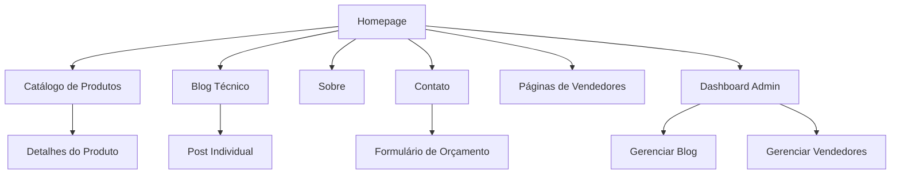

# Documento de Requisitos do Produto - Tronco Forte

## 1. Visão Geral do Produto

Site institucional e comercial para a madeireira Tronco Forte, especializada em madeira 100% legalizada para construção civil e marcenaria. O produto visa transmitir confiança, sustentabilidade e competência técnica através de uma experiência digital robusta e profissional.

O objetivo é posicionar a Tronco Forte como referência em madeira legalizada, facilitando a jornada de compra de construtores e marceneiros através de ferramentas interativas e informações técnicas detalhadas.

## 2. Funcionalidades Principais

### 2.1 Papéis de Usuário

| Papel | Método de Acesso | Permissões Principais |
|-------|------------------|----------------------|
| Visitante | Acesso direto ao site | Navegar, usar calculadoras, solicitar orçamentos |
| Administrador | Dashboard interno | Gerenciar blog, páginas de vendedores, conteúdo |

### 2.2 Módulo de Funcionalidades

Nossos requisitos consistem nas seguintes páginas principais:

1. **Homepage**: seção hero com vídeo, calculadora de m³, timeline sustentável, catálogo inteligente, mapa de origem, galeria de transformação, prova social dinâmica
2. **Catálogo de Produtos**: grid interativo com filtros por aplicação, detalhes técnicos, certificações
3. **Blog Técnico**: posts sobre madeiras e aplicações, sistema de categorias
4. **Páginas de Vendedores**: estilo Linktree personalizado para cada vendedor
5. **Dashboard Administrativo**: gerenciamento de blog e páginas de vendedores
6. **Página Sobre**: história da empresa, certificações, sustentabilidade
7. **Página de Contato**: formulário, localização, informações comerciais

### 2.3 Detalhes das Páginas

| Nome da Página | Nome do Módulo | Descrição da Funcionalidade |
|----------------|----------------|-----------------------------|
| Homepage | Header Fixo | Exibir logo, menu de navegação (Produtos, Sobre, Contato), botão WhatsApp fixo |
| Homepage | Seção Hero | Apresentar headline "Madeira 100% Legal para Sua Obra", vídeo de fundo, calculadora de m³ interativa |
| Homepage | Timeline Sustentável | Mostrar jornada visual "Da Floresta à Sua Obra" com animações de scroll |
| Homepage | Catálogo Inteligente | Exibir grid de produtos com filtros por projeto (deck, estrutura, acabamento) |
| Homepage | Mapa de Origem | Visualizar florestas fornecedoras com certificações interativas |
| Homepage | Calculadora de Projeto | Ferramenta "Quanto preciso para meu projeto?" com preview visual |
| Homepage | Matchmaker de Madeira | Quiz interativo "Qual madeira ideal pro seu projeto?" |
| Homepage | Galeria de Transformação | Before/After de projetos reais com madeiras específicas |
| Homepage | Prova Social Dinâmica | Contador em tempo real de m³ entregues, depoimentos rotativos |
| Homepage | CTA Final | Formulário "Solicite seu Orçamento Personalizado" com preview do processo |
| Catálogo de Produtos | Grid de Produtos | Listar produtos com imagens, especificações técnicas, filtros por aplicação |
| Catálogo de Produtos | Detalhes do Produto | Mostrar informações completas, certificações, aplicações recomendadas |
| Blog Técnico | Lista de Posts | Exibir artigos sobre madeiras e aplicações, sistema de categorias |
| Blog Técnico | Post Individual | Apresentar conteúdo completo, imagens, informações técnicas |
| Páginas de Vendedores | Links Personalizados | Criar páginas estilo Linktree com links e informações de cada vendedor |
| Dashboard Administrativo | Gerenciamento de Blog | Criar, editar, excluir posts e categorias do blog |
| Dashboard Administrativo | Gerenciamento de Vendedores | Criar e editar páginas de links dos vendedores |
| Página Sobre | História da Empresa | Apresentar trajetória, missão, valores, certificações |
| Página Sobre | Sustentabilidade | Destacar práticas sustentáveis, origem legal da madeira |
| Página de Contato | Formulário de Contato | Capturar leads com campos específicos para tipo de projeto |
| Página de Contato | Informações Comerciais | Exibir endereço, telefones, horários, mapa de localização |

## 3. Processo Principal

O fluxo principal do usuário segue a jornada: entrada via Google ou indicação → navegação pela homepage (hero → catálogo → diferenciais) → solicitação de orçamento via formulário ou WhatsApp → follow-up comercial.

Fluxo de navegação:



## 4. Design da Interface do Usuário

### 4.1 Estilo de Design

- **Cores primárias e secundárias**: Verde floresta (#2D5016), Marrom madeira (#8B4513), Laranja terroso (#D2691E)
- **Estilo dos botões**: Arredondados com efeitos de hover suaves, elevação sutil
- **Fonte e tamanhos preferenciais**: Roboto - H1 (36px), H2 (28px), H3 (24px), body (16px)
- **Estilo de layout**: Design limpo com elementos orgânicos, texturas sutis de madeira, cards com elevação
- **Sugestões de emoji/ícones**: Ícones Lucide para consistência, elementos naturais (árvores, folhas), certificações

### 4.2 Visão Geral do Design das Páginas

| Nome da Página | Nome do Módulo | Elementos da UI |
|----------------|----------------|----------------|
| Homepage | Seção Hero | Vídeo de fundo em loop, overlay com gradiente verde, tipografia bold branca, calculadora com cards flutuantes |
| Homepage | Timeline Sustentável | Linha do tempo vertical com ícones animados, cores terrosas, transições suaves no scroll |
| Homepage | Catálogo Inteligente | Grid responsivo 3x3, cards com hover elevation, filtros com chips coloridos, imagens WebP com lazy loading |
| Homepage | Mapa de Origem | Mapa interativo com marcadores verdes, tooltips com certificações, animações de zoom |
| Catálogo de Produtos | Grid de Produtos | Layout masonry, filtros laterais sticky, cards com gradiente sutil, badges de certificação |
| Blog Técnico | Lista de Posts | Layout de blog moderno, cards com imagens destacadas, categorias com cores temáticas |
| Dashboard Administrativo | Interface Admin | Design clean e funcional, tabelas responsivas, formulários bem estruturados |

### 4.3 Responsividade

O produto segue abordagem mobile-first com design totalmente responsivo. Otimização para touch em dispositivos móveis, com navegação adaptativa e componentes que se ajustam fluidamente a diferentes tamanhos de tela.

**Stack Tecnológica:**
- Framework Base: FlightPHP
- Frontend: Tailwind CSS (via CDN), Alpine.js (via CDN)
- Ícones: Lucide (via CDN)
- Carrosséis: GlideJS (via CDN)
- Gerenciador de pacotes: Bun

**Configuração de Cores Tailwind:**
```javascript
colors: {
  primary: {
    50: '#F0F9E8',
    500: '#2D5016',
    900: '#1A300D'
  },
  wood: {
    300: '#DEB887',
    500: '#8B4513',
    700: '#654321'
  },
  accent: '#D2691E'
}
```

**Otimizações de Performance:**
- Meta Lighthouse: 95+
- Imagens WebP com lazy loading
- CSS crítico inline
- Meta tags otimizadas para SEO local
- Schema markup para produtos e empresa

**Palavras-chave SEO:**
- Primárias: madeira legalizada, madeira construção civil, madeira serrada
- Secundárias: pinus tratado, eucalipto beneficiado, ipê para deck
- Local: madeireira [cidade]

**Crédito de Desenvolvimento:**
Desenvolvido por [Essência Marketing e Gestão](https://essenciamarketing.com.br/)